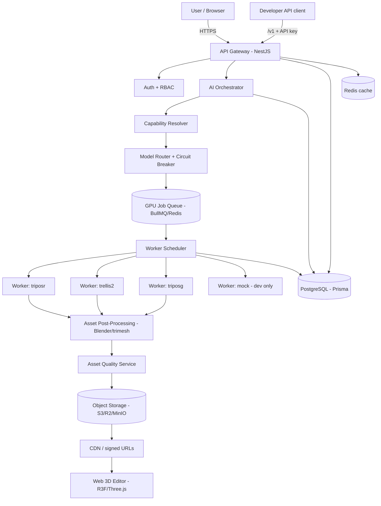
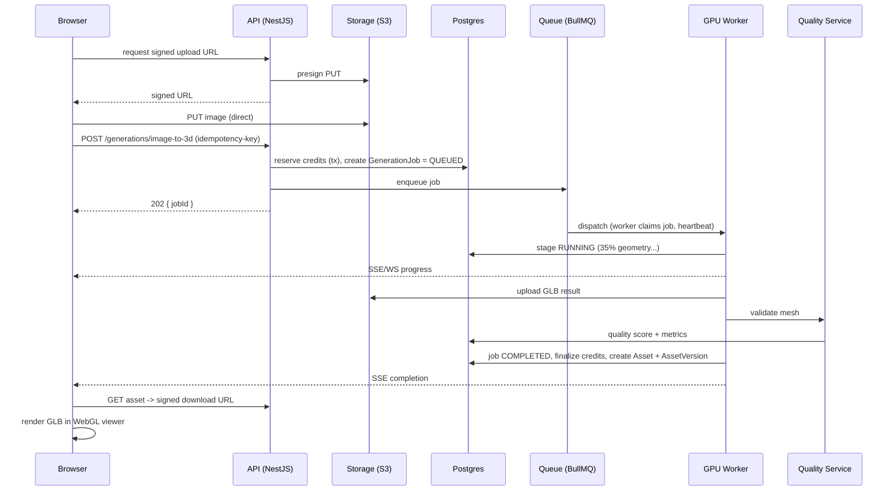
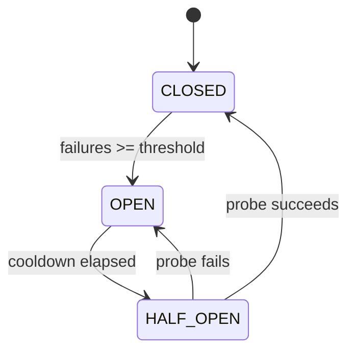

# VEYRA 3D — Architecture

## 1. Guiding principles

1. **Model-agnostic.** Every AI model is behind a `ThreeDProvider` adapter. The
   frontend and business logic ask for a capability at a quality tier; the
   router chooses the provider. Swapping or adding a model touches only its
   adapter + config.
2. **GPU work is never synchronous over HTTP.** Generation is a queued job.
   Progress is streamed over WebSocket/SSE from real worker stage reports.
3. **Isolation of Python ML environments.** Each AI worker is its own container
   with its own pinned dependencies. They never share a Python environment.
4. **Assets are immutable + versioned.** Every operation produces a new
   `AssetVersion`; originals are never overwritten.
5. **Billing is transactional.** Credits are reserved, then finalized or
   refunded atomically. Corrupt output is never billed.

## 2. High-level system



## 3. Image-to-3D request lifecycle (first milestone)



## 4. Provider adapter contract

Every provider implements (`packages/ai-sdk`):

```ts
interface ThreeDProvider {
  readonly id: string;                 // e.g. "trellis2"
  readonly meta: ProviderMeta;         // family, version, licensing
  capabilities(): Capability[];
  healthCheck(): Promise<ProviderHealth>;
  estimateCost(input: GenerationInput): Promise<CostEstimate>;
  generate(input: GenerationInput, ctx: JobContext): Promise<JobResult>;
  cancel(jobId: string): Promise<void>;
}
```

The adapter is a thin **transport** to the worker's HTTP API. The heavy Python
lives in the worker container. This keeps Node dependencies clean and lets us
test adapters with a mocked transport in CI (no GPU).

## 5. Routing

The router scores enabled, healthy providers for a request using: requested
quality/speed/cost, input type, target usage, polygon target, PBR requirement,
provider health, queue load, available VRAM, estimated cost, and recent failure
rate. It supports **fallback chains** (e.g. `trellis2 → triposg → triposr`) and a
**circuit breaker** per provider (failure counter → cooldown → health probe →
restore).



## 6. Text-to-3D as a workflow

Strongest models are image-conditioned, so Text-to-3D is an explicit,
**resumable** workflow whose state is persisted per stage:
`PROMPT_ANALYSIS → PROMPT_ENHANCEMENT → CONCEPT_IMAGE → IMAGE_PREPROCESS →
SHAPE_GENERATION → TEXTURE_GENERATION → POSTPROCESS → QUALITY_CHECK → EXPORT`.
A crashed worker resumes from the last successful stage. See
[workflows.md](workflows.md).

## 7. Data + storage

- **PostgreSQL** (Prisma) is the system of record. UUID PKs, soft deletes where
  needed, transactions for credits/payments/job finalization.
- **Object storage** (S3/R2/MinIO) holds all binaries. Files are uploaded
  directly via signed URLs — never streamed through the API. Buckets are
  private; downloads use short-lived signed URLs.
- **Redis** for cache (provider health, plan config, gallery) and the BullMQ
  queue.

## 8. Trust boundaries

- Browser ↔ API: session cookies (UI) or API keys (`/v1`).
- API ↔ Workers: separate `WORKER_SHARED_SECRET`, internal network only. Worker
  APIs are never exposed publicly.
- Uploaded files are untrusted: validated by magic bytes + size + parseability
  before processing. Uploaded scripts are never executed.

See [security.md](security.md).

## 9. Scaling path

BullMQ now; the `queue` package exposes an interface so RabbitMQ/Kafka can be
introduced later. Postgres full-text search now; OpenSearch later. Single-tenant
now; the schema leaves room for organizations/teams (enterprise) without a
rewrite.
