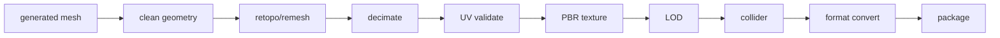

# Workflows

Multi-stage generations are modeled as **resumable workflows** whose per-stage
state is persisted (`GenerationStage`), so a crashed worker resumes from the last
successful stage rather than restarting (spec §6).

## Text-to-3D

Strongest models are image-conditioned, so Text-to-3D is an explicit workflow,
not a pretend "native" capability:

Each stage writes its output to `GenerationStage.output`; resume skips
`COMPLETED` stages. Stage order + statuses are typed in `@veyra/types`
(`TextTo3DStage`, `TEXT_TO_3D_STAGE_ORDER`).

## Image-to-3D (first milestone)

`upload → route → run provider (fallback) → quality gate → persist asset +
version + files → finalize credits → SSE completion`. Implemented in
`GenerationProcessor`.

## Game-Ready

Options: `targetEngine` (UNITY/UNREAL/GODOT/WEB/MOBILE), `targetPolygons`,
`textureResolution`, `generateLODs`, `generateCollider`, `compressTextures`.
Heavy geometry ops run in the **asset-worker** (Blender/trimesh/meshoptimizer),
never in the web API.

## Multi-image → 3D

`MultiImageGenerationRequest` accepts front/back/left/right + extra references.
If a provider supports native multi-view conditioning it's used; otherwise the
selected workflow runs. Unsupported providers are never silently treated as
multi-image capable (spec §36).

## AI Agent

Natural language → structured workflow. The agent selects only from **approved**
workflow operations and can never execute arbitrary shell commands (spec §37).
